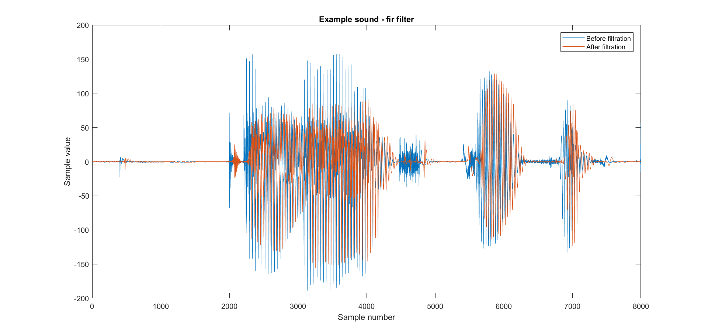
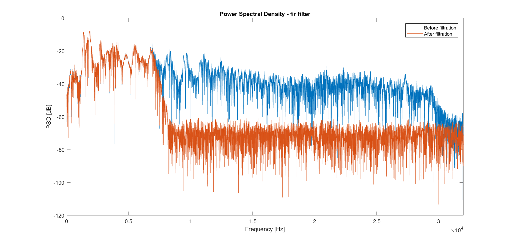
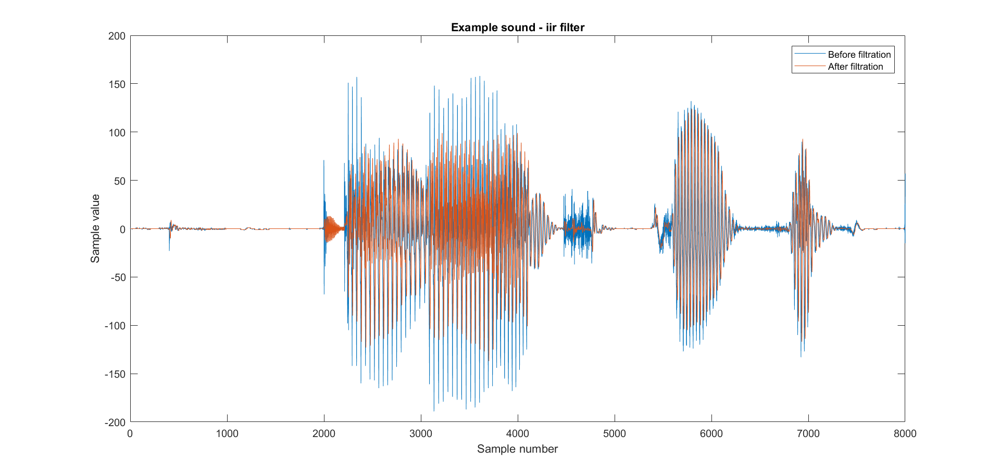
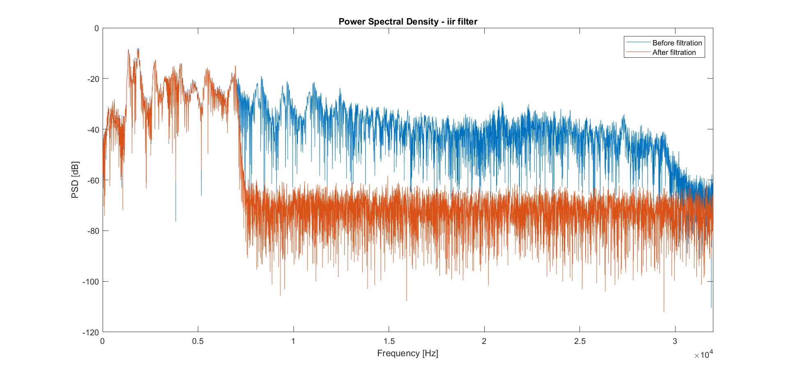

# FIR IIR implementation
Implementation of irr and fir filters in c. Example of filter design and visualization using matlab. University assignment in digital signal processing.
## Example
### Fir filter:

### Iir filter:

