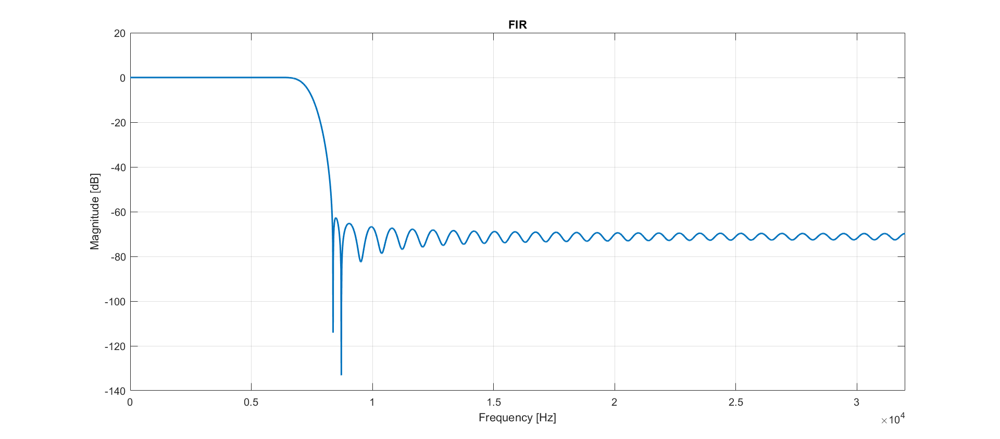
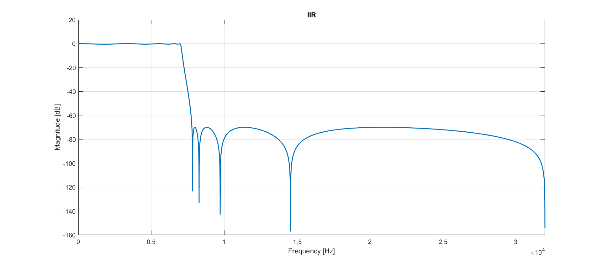

# FIR IIR implementation
Implementation of irr and fir filters in c. Example of filter design and visualization using matlab. University assignment in digital signal processing.
## Example
* In firs step run filterDesigne.m Matlab script.
* Next run filtration 
```
$ gcc filter.c -o filter
$ filter f1<Example\example_sound>>IIR
$ filter f2<Example\example_sound>>FIR
```
* To visualize the results use plotData.m Matlab script.
### Low pass filters


### Fir filter:


### Iir filter:


